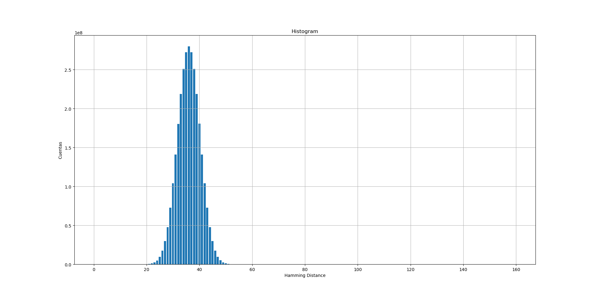

# HDR

Herramienta para evaluar la distancia de Hamming entre hashes (SHA-1) de repositorios de git.

## Compilacion

**Dependencias**: libgit2, C++ std23 y Doxygen para generar la documentacion.

### Compilar hdr
```
$ make
```
Para generar la documentacion (still in progress!):

### Compilar documentacion
```
$ make docs
```

## Uso
Al igual que _git_, _hdr_ se ejecuta sobre un repo de git (con hashes del tipo SHA-1):
```
$ cd <repositorio>
```

Todos los comandos implementados en _hdr_ generan una salida hacia _stdout_. Estos comandos permiten evaluar:

### Distancias de Hamming

```
$ hdr hd
```

Opcionalmente, se puede pasar el argumento de largo abreviado de los hashes, por ejemplo, para largo abreviado de 10 bytes:

```
$ hdr hd --alen 10
```

### Histograma de distancias de Hamming
```
$ hdr hist [--alen nro]
```

Esto genera un histograma con la cantidad de veces que se obtienen los  valores posibles de distancia de Hamming ()

### HD Stats
```
$ hdr hdstats [--alen nro]
```

Genera un vector de ternas: min, max, mean.

### Print
```
$ hdr print [--alen nro]
```

Imprime la lista de hashes para el largo abreviado suministrado.

### Plot de histograma

Puede plotearse el histograma a partir de un archivo.

Por ejemplo:

```
$ hdr hist --alen 9 > /tmp/git_hist_9.csv
$ python plot_scripts/histogram.py /tmp/git_hist_9.csv
```

Generan el siguiente grafico:


